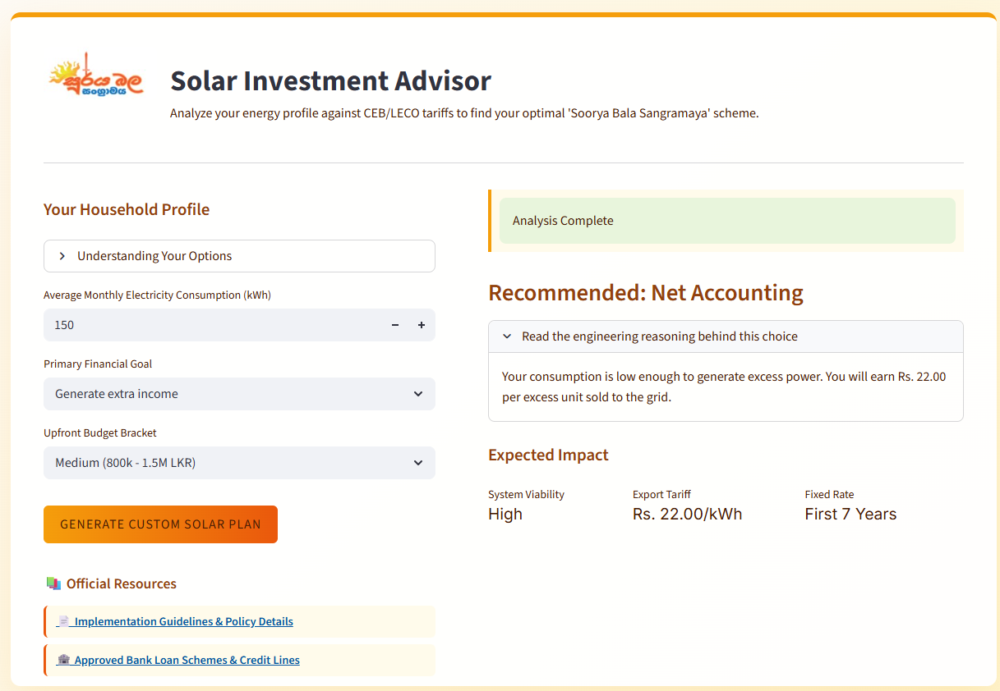

# ☀️ Soorya Bala Sangramaya Expert System 


An interactive, rule-based Expert System designed to navigate the complex residential solar policies of the Ceylon Electricity Board (CEB) and Lanka Electricity Company (LECO). 

This tool acts as an automated energy consultant, analyzing a household's consumption profile, financial goals, and upfront budget to recommend the optimal solar investment scheme under the Sri Lankan **"Soorya Bala Sangramaya"** (Battle for Solar Energy) initiative.

> **View the Demo:** > 

## ⚡ Engineering Context & Logic
Navigating utility tariffs requires strict logical frameworks. This project maps real-world energy policies into a deterministic Expert System. 

The Inference Engine evaluates user data against three primary schemes:
1. **Net Metering:** Optimal for high-consumption households seeking to offset bills without tax/payment overhead.
2. **Net Accounting:** Recommended for low-to-medium consumption households looking to earn an export tariff (Rs. 22.00/unit) on excess generation.
3. **Net Plus (Micro Solar Power Producer):** Designed for high-budget investments utilizing a dedicated export meter.

**Intelligent Fallbacks:** The system incorporates specific engineering edge cases. For example, if a user inputs a low budget but exceptionally high monthly consumption (e.g., >300 kWh), the system intelligently overrides an "income generation" goal, recognizing that a small solar array cannot physically generate excess power under that load profile.

## 🛠️ Architecture
This project strictly adheres to Expert System architecture, cleanly separating the **Knowledge Base** from the **Inference Engine** and **User Interface**.
* **Knowledge Base & Engine:** Written in `CLIPS` (C Language Integrated Production System), utilizing forward-chaining logic.
* **Logic Bridge:** Integrated via `clipspy`.
* **User Interface:** Built with Python and `Streamlit` for a modern, accessible web interface.

## 🚀 How to Run Locally

1. **Clone the repository:**
   ```bash
   git clone [https://github.com/YourUsername/soorya-solar-expert-system.git](https://github.com/YourUsername/soorya-solar-expert-system.git)
   cd soorya-solar-expert-system# soorya-solar-expert-system
An automated energy consultant mapping CEB/LECO utility tariffs into a deterministic AI. Built with CLIPS and Streamlit to analyze consumption profiles and output financial recommendations.
